# Overview

**GITS** supports capture and replay of **DirectStorage** commands as part of the **DirectX12** backend.

All the `DSTORAGE_REQUEST_SOURCE_FILE` reads are stored into the **DirectStorageResources.bin** file (part of the GITS stream). This allows **gitsPlayer.exe** to replay the **DirectStorage** commands.

See the diagram below:

```mermaid
graph TB
    subgraph GAME["📁 Application"]
        GAME_EXE["🖥️ Application.exe"]
        GAME_RES["data00.pak<br/>data01.pak<br/>..."]
    end
    subgraph GITS_STREAM_DIR["📁 GITS Stream"]
        GITS_STREAM["stream.gits2"]
        GITS_DSTORAGE_BIN["DirectStorageResources.bin"]
    end
    GITS_RECORDER_LIB["📦 gitsRecorder.dll"]
    GITS_EXE["🖥️ gitsPlayer.exe"]
    GAME_EXE --API Stream--> GITS_RECORDER_LIB
    GAME_RES --File Reads--> GITS_RECORDER_LIB
    GITS_RECORDER_LIB --> GITS_STREAM
    GITS_RECORDER_LIB --> GITS_DSTORAGE_BIN
    GITS_STREAM --API Stream--> GITS_EXE
    GITS_DSTORAGE_BIN --File Reads--> GITS_EXE
```

# Notes

- Support for this feature can be toggled in the config file by using the `DirectX.Capture.CaptureDirectStorage` option.
- Custom compression (`DSTORAGE_CUSTOM_COMPRESSION_0`) is not supported.
- Memory source reads (`DSTORAGE_REQUEST_SOURCE_MEMORY`) are not supported.
- `IDStorageQueueSubmit` operations are synchronized (cause a Wait) on **gitsPlayer.exe**.
