```mermaid
flowchart LR

    A(Application):::app ---> R(gitsRecorder):::gits
    R ---> SR[(Stream)]:::stream

    P ---> D(Display):::show
    P ---> Res(Resources):::res

    subgraph GITS ["`**GITS**`"]
    C{{Configuration}}:::conf -.-> R
    C{{Configuration}}:::conf -.-> P
    end
    SP[(Stream)]:::stream ---> P(gitsPlayer):::gits

    classDef strokeStyle stroke:#fff,stroke-width:2px,color:#fff
    classDef gits fill:#006FC5
    classDef app fill:#C40500
    classDef show fill:#38C400
    classDef stream fill:#254F6F
    classDef res fill:#00C4B1
    classDef conf fill:#C400B3

    class A,R,SR,P,D,Res,E,,SP,C strokeStyle

    classDef gitsSubgraphStyle stroke:#006FC5,stroke-width:2px,color:#fff,fill:#006FC580,stroke-dasharray:5
    class GITS gitsSubgraphStyle
```

---
hide:
  - navigation
---
# Graphics Intercept and Trace Solution (GITS)

**Graphics Intercept and Trace Solution** (**GITS**) is an opensource capture-replay tool by [Intel](https://www.intel.com) for  

- [Vulkan :fontawesome-solid-arrow-up-right-from-square:](https://vulkan.org/)
- [OpenCL :fontawesome-solid-arrow-up-right-from-square:](https://www.khronos.org/opencl/)
- [Intel oneAPI Level Zero :fontawesome-solid-arrow-up-right-from-square:](https://spec.oneapi.io/level-zero/latest/core/INTRO.html) and 
- [OpenGL :fontawesome-solid-arrow-up-right-from-square:](https://www.khronos.org/opengl/).

**GITS** allows you to record sequences of API calls. You can either serialize them into binary traces that can be replayed later (we call them '*streams*'), or you can generate a C++ project from them (we call it '*CCode*'). See the [Usage section](#usage) for more info.

#### Target audience
**GITS** is a collection of *command line tools* which has been used for years to help develop and validate *Intel GPU drivers*, but we think it can be useful to other users as well. 

*Please note: if you are a game developer who wants to analyze frames using a graphical tool, [GPA](https://www.intel.com/content/www/us/en/developer/tools/graphics-performance-analyzers/overview.html) or a similar tool is what you should look at.*

## Install & Building

Currently we do not provide prebuilt binaries, so you have to [build it yourself](building.md). **GITS** is written in C++ so you will need a *compiler*, a *build system* and *Python 3*. 

## Usage

To **record an application**, you will have to inject our dynamic library (called '*the interceptor*') into it. On *Windows*, this is typically done by copying a DLL into the app directory. On *Linux*, by manipulating loader environment variables. When recording *Vulkan*, it is also possible to use **GITS** as a *Vulkan layer* instead.

To **replay a stream**, pass it as an argument to the **gitsPlayer**-executable. 

We provide a general introduction to [using GITS](usage.md) as well as more detailed information, that can be found in the [documentation](documentation/terminology.md) and/or the [userguides](userguides/userguide.md) section. 
